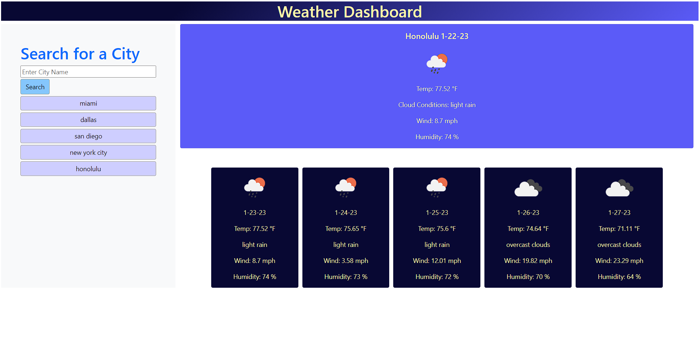

# Weather Dashboard

## Project Summary

The goal of this assignment is to create a weather dashboard that will show the current weather plus the five day forcast for a selected city and it will be able to run in the browser or on smaller devices. The weather dashboard will feature dynamically updated HTML and CSS that utilizes the openweathermap.org API to retrieve data. It will also be able to store any persistent date from previously searched cities in local storage after the page has been refreshed.

### Here is the link to the final version of the project.

[Click here to see my Weather Dashboard.](https://christopherrclark.github.io/weather-dashboard/)

